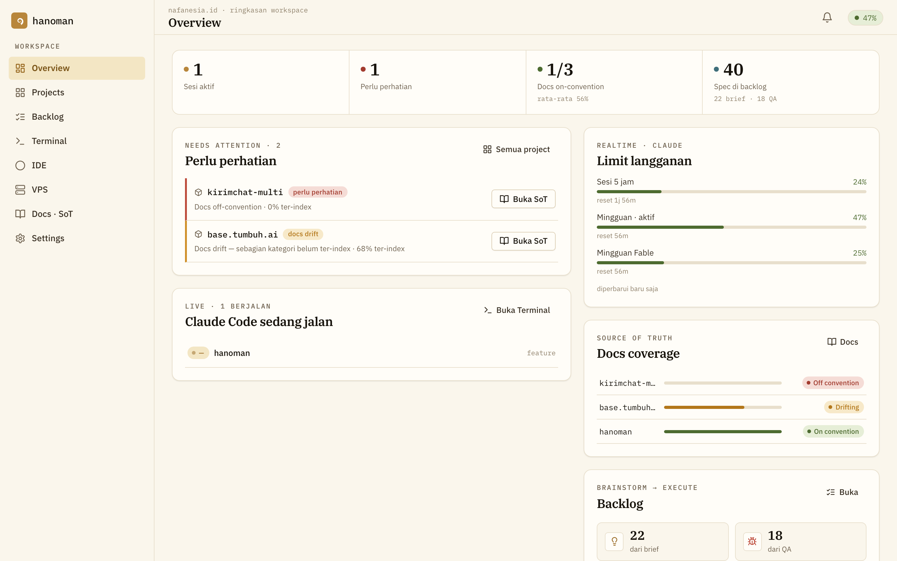
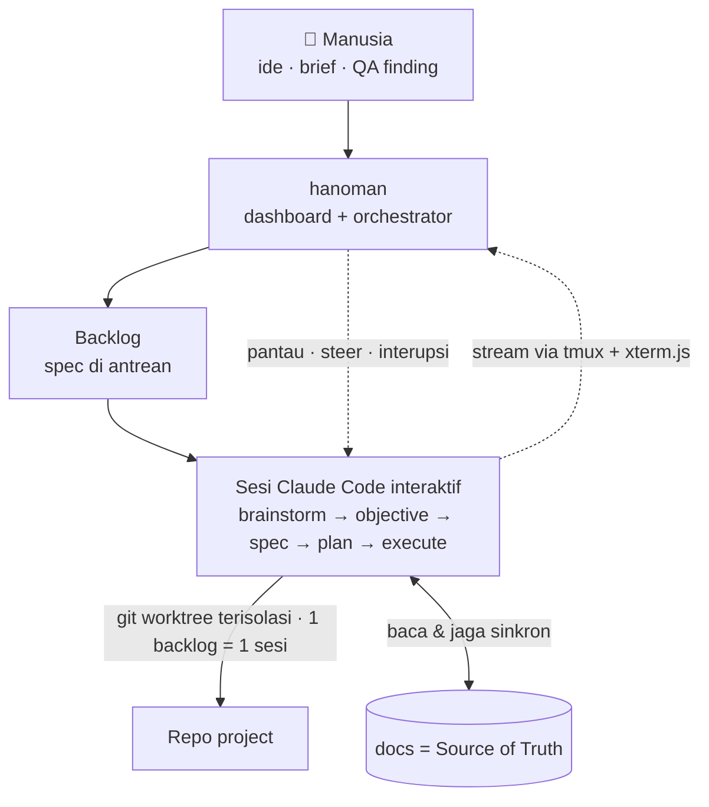
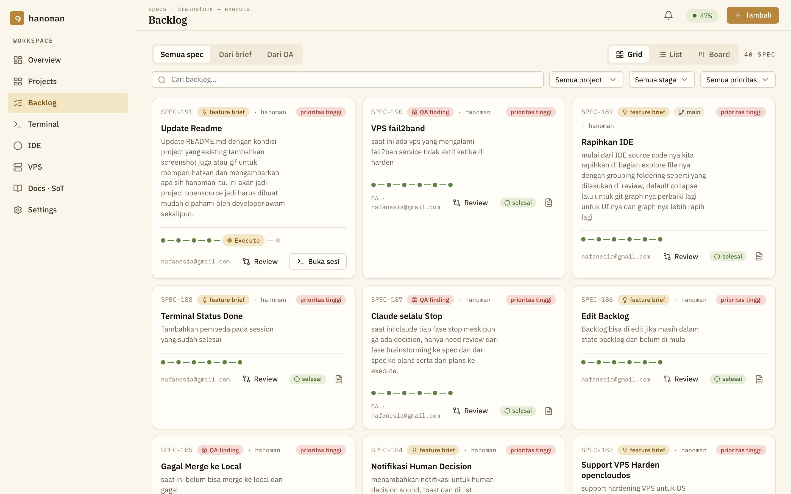
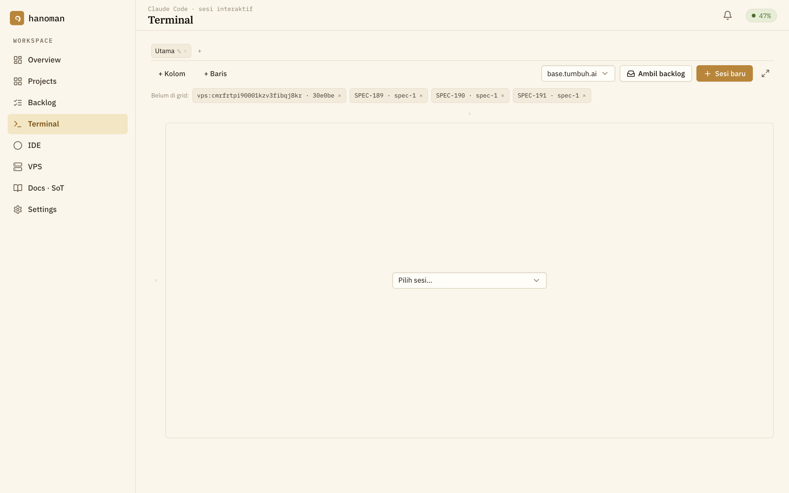
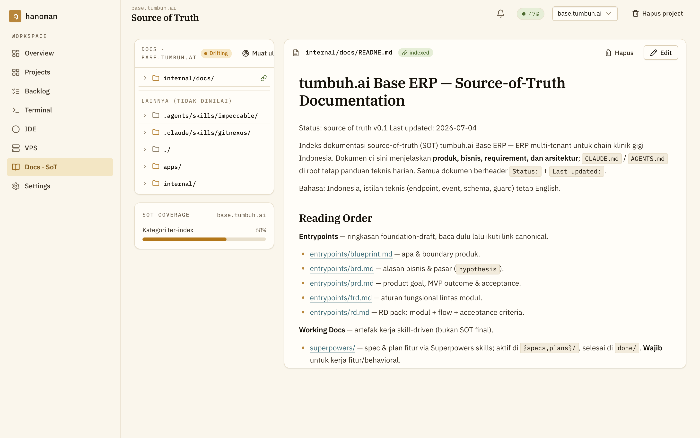

<div align="center">


# hanoman

**Satu dashboard untuk menjalankan & memantau Claude Code di banyak project sekaligus — dengan dokumentasi sebagai Source of Truth.**

</div>

<div align="center">
  
</div>

## Apa itu hanoman?

hanoman adalah **orchestrator + dashboard** untuk pengembangan yang digerakkan dokumentasi.
Kamu menuang ide (brief) atau memfilekan bug (QA finding); hanoman menjalankannya sebagai
**sesi [Claude Code](https://claude.com/claude-code) interaktif** yang mengerjakan tiap fase —
brainstorm → objective → spec → plan → execute — di dalam **git worktree terisolasi**, satu
per backlog item. Kamu memantau semua sesi secara realtime dari satu tempat, dan bisa
menyetir atau menginterupsi kapan pun. Dokumentasi project (`internal/docs/**`) adalah
**Source of Truth**: sumber kebenaran yang menjaga tiap langkah tetap jujur.

## Cara kerjanya



Kerja **fitur** lewat alur `brainstorm → objective → spec → plan → execute`.
Kerja **QA** lewat alur `audit → spec → plan → execute` (akar masalah dulu, baru perbaikan).
"Fase" bukan proses terpisah — ia **giliran** di dalam satu sesi Claude, jadi konteks terbawa
utuh dari awal sampai selesai.

## Sekilas layar

| Backlog — spec dari brief/QA, progres tiap tahap | Terminal — sesi Claude Code interaktif |
|---|---|
|  |  |

**Source of Truth** — docs project di-index & dipantau drift-nya:



## Konsep inti

- **Docs adalah Source of Truth.** `internal/docs/**` diperbarui pada commit yang menyentuhnya —
  kebenaran secara konvensi, dijaga oleh alur kerja, bukan gerbang mekanis.
- **Manusia pegang kendali penuh.** Bahkan saat berjalan otomatis, tiap sesi bisa di-steer,
  dijawab, atau diinterupsi langsung dari Terminal. hanoman berhenti dan bertanya hanya saat
  butuh keputusan manusia yang nyata.
- **Isolasi via git worktree.** Tiap backlog dikerjakan di worktree-nya sendiri
  (`<repo>/.worktrees/<id>`), tak pernah di working tree utama. **Satu backlog = satu sesi.**
- **From-scratch atau existing.** Project baru di-scaffold dari nol; codebase yang sudah ada
  di-*reverse-engineer* docs-nya lebih dulu.

## Untuk AI agent

Panduan lengkap supaya agen mana pun bisa langsung memakai hanoman — cukup diberi **tautan + satu
agent token**, tanpa penjelasan tambahan dari manusia:
**[docs/agent-integration.md](docs/agent-integration.md)**.

Isinya: model kerja hanoman (backlog → sesi → worktree), autentikasi `Bearer hnm_agt_…`, capability
per-domain dan arti 403, endpoint tersering + bentuk payload `POST /specs`, tindakan berbahaya yang
wajib dikonfirmasi manusia, jebakan yang sudah diketahui, dan alur end-to-end siap salin.

Instance hanoman yang berjalan menyajikan **naskah yang sama** sebagai markdown mentah, tanpa auth —
jadi agen bisa membacanya sendiri:

```bash
curl -fsS https://hanoman.example/api/agent-integration.md
```

Agen yang berbicara **MCP** cukup memasang `hanoman mcp` (17 tool, capability yang sama).

## Pasang sebagai paket npm

```bash
npm i -g hanoman
hanoman doctor     # periksa prasyarat
hanoman            # jalan di http://127.0.0.1:8787
```

Buka URL-nya, buat akun pertama, selesai. Datanya di `~/.hanoman/` — SQLite embedded, **tanpa Docker,
tanpa Postgres, tanpa Redis** ([ADR-0086](internal/docs/adr/0086-sqlite-satu-satunya-provider.md) ·
[ADR-0087](internal/docs/adr/0087-distribusi-npm-global-satu-perintah.md)). Update: `hanoman update`.

Yang npm **tidak** bisa bawa, karena itu inti produknya: `git` (worktree per sesi), `tmux` (sesi agen
selamat dari restart API, [ADR-0016](internal/docs/adr/0016-sesi-terminal-hidup-di-tmux.md)), dan CLI
agen `claude` dan/atau `codex` yang sudah login. `hanoman doctor` melaporkan mana yang belum ada.
Detail perintah & konfigurasi: [operations/npm-readme](internal/docs/operations/npm-readme.md).

## Mulai (dari checkout, untuk mengembangkan hanoman)

**Prasyarat:** Node.js ≥ 20 · [pnpm](https://pnpm.io/) · [tmux](https://github.com/tmux/tmux) ·
[Claude Code CLI](https://claude.com/claude-code) yang sudah login.

```bash
pnpm install
pnpm dev        # API (:8787) + dashboard (:5173)
```

Lalu buka **http://localhost:5173**, buat akun pada layar setup pertama, dan tambahkan project.

> DB dev adalah berkas SQLite (`DATABASE_URL=file:../../hanoman-dev.db` di `.env` — lihat
> `.env.example`), dimigrasi dengan `pnpm db:migrate`. Sesi memakai kredensial `claude`/`codex` yang
> sudah login di terminalmu. Merakit paket npm-nya: `pnpm release`.

## Struktur repo

```
src/            dashboard (React + TypeScript + Vite, xterm.js)
server/         orchestrator: Fastify · Prisma/SQLite · node-pty + tmux
runner/         library git-worktree + pembangun prompt + resolusi path data (bukan proses)
cli/            biner `hanoman`: start · doctor · update · migrate-from-postgres · docs · hook
shared/         tipe & DTO dipakai bersama server ↔ web
internal/docs/  SOURCE OF TRUTH — baca ini lebih dulu
docs/           spec & plan kerja (superpowers) + aset README
.claude/        konfigurasi & hooks Claude Code
```

Stack: React + Vite · **Fastify** · SQLite (**Prisma 6**) · **node-pty + tmux** · xterm.js.
Eksekusi adalah sesi `claude` interaktif per backlog di git worktree — tanpa message queue,
worker, cron, maupun webhook (semuanya dicabut di
[ADR-0024](internal/docs/adr/0024-sesi-interaktif-menggantikan-run.md)).

## Handoff ke Claude Code

1. Baca `internal/docs/README.md` — index Source of Truth.
2. Ikuti `AGENTS.md` + `CLAUDE.md`.
3. Ambil spec dari **Backlog** di dashboard → **Buka sesi** → pantau di **Terminal**.

---

<div align="center"><sub>Chiranjivi — docs (Source of Truth) abadi melampaui commit.</sub></div>
